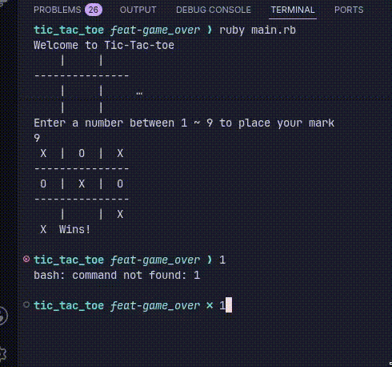

# Tic Tac Toe


## Description



A command-line Tic Tac Toe game built as part of [The Odin Project](https://www.theodinproject.com/) Ruby curriculum. Two human players take turns marking a 3x3 board, with the board displayed between turns, until one player wins or the game ends in a draw.

This project focuses on applying Object Oriented Programming principles — breaking a problem into classes, deciding what belongs to each class, and keeping information sharing between classes to a minimum.

---

## Table of Contents

- [Planning](#planning)
- [Project Structure](#project-structure)
- [Usage](#usage)
- [Installation](#installation)
- [What I'm Learning](#what-im-learning)

---

## Planning

Before writing any code, the game was broken down into the following classes and responsibilities:

| Class | Knows (instance variables) | Does (methods) |
|---|---|---|
| `Board` | the grid state | display board, update cell, check win/draw |
| `Player` | name, marker (X/O) | — |
| `Game` | players, current turn, board | game loop, switch turns, announce result |

> This table will be refined as the design develops.

TODO:
[x] instanciating the board and drawing it correctly 
[x] simple loop to rotate between player 1 and 2 
[ ] Checking winning conditions to break the loop, end the game and announce the winner

---

## Project Structure

```bash
tic_tac_toe/
├── lib/
│   ├── board.rb
│   ├── player.rb
│   └── game.rb
├── Gemfile
├── .ruby-version
└── main.rb
```

---

## Usage

```bash
ruby main.rb
```

Players take turns entering a position (1-9) to place their marker. The board is displayed after each turn.

---

## Installation

1. Clone the repository:
```bash
git clone https://github.com/yourusername/tic-tac-toe.git
```

2. Navigate into the project:
```bash
cd tic-tac-toe
```

3. Install dependencies:
```bash
bundle install
```

4. Run the game:
```bash
ruby main.rb
```

---

## What I'm Learning

- Breaking down a problem into classes, instance variables, and methods before coding
- Applying `private`/`protected`/`public` scope to keep classes loosely coupled
- Structuring a multi-file Ruby project with `lib/`, `Gemfile`, and `.ruby-version`
- Using `require_relative` to organize code across files
- Building and managing a game loop with `loop` and `break`

---

## Project

This project is part of the [Ruby Programming path](https://www.theodinproject.com/paths/full-stack-ruby-on-rails/courses/ruby) on The Odin Project.